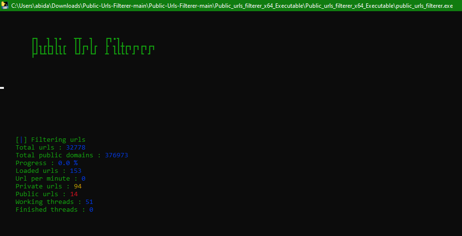

# Public URLs Filterer

<p align="center">
  <pre style="color: #00FF00; background-color: #000000;">
        ┏┓  ┓ ┓•   ┳┳  ┓   ┏┓•┓         
        ┃┃┓┏┣┓┃┓┏  ┃┃┏┓┃┏  ┣ ┓┃╋┏┓┏┓┏┓┏┓
        ┣┛┗┻┗┛┗┗┗  ┗┛┛ ┗┛  ┻ ┗┗┗┗ ┛ ┗ ┛ 
  </pre>
<p>

## Overview

**Public URLs Filterer** is a robust tool designed to efficiently retain private URLs from large lists of URLs. It filters URLs based on domain lists specified in text files within a user-defined directory. The tool processes vast quantities of URLs using multithreading, ensuring that only private URLs are retained. The results are always saved in the `result` directory, which must remain next to the script file.

This tool is ideal for those who need to sift through massive URL lists and want to ensure that only private URLs are included in their final dataset.

## Features

- **Efficient Filtering**: Retains only private URLs based on domain lists.
- **Multithreading**: Utilizes threading to process URLs quickly and efficiently.
- **Customizable**: Users specify the directory containing domain filters and the directory of URL lists.
- **Output**: The retained private URLs are saved in the `result` directory, which must not be deleted.
- **Executable Version**: Available as a Python script and as an executable for easy deployment.
- **Requirements**: Includes a `requirements.txt` file for easy environment setup.

## Installation

### 1. Clone the Repository

```bash
git clone https://github.com/AbidAbed/Public-Urls-Filterer.git
cd Public-Urls-Filterer
```

### 2. Install the Requirements

Ensure you have Python installed. Then install the required Python packages:

```bash
pip install -r requirements.txt
```

### 3. Run the Tool

To run the script, use:

```bash
python public_urls_filterer.py
```

Alternatively, you can run the executable version:

```
1. Unzip Public_urls_filterer_x64_Executable.zip
2. Run public_urls_filterer.exe
```

## Usage

1. **Prepare Your Domain Filters**: Place text files containing domains that should be considered public in the desired directory, for example, `AntiPublic`. Each line should contain one domain.

2. **Place Your URL Lists**: Place your URL lists in `.txt` files in the desired directory where the script/executable will read from, such as a directory named `urls`.

3. **Run the Tool**: The tool will prompt you to enter:
   - The path to the directory containing your domain filters.
   - The path to the directory containing your URL lists.
   - The number of threads you want to use for processing.

4. **Check the Results**: The retained private URLs will be saved in the `result` directory, each in its respective file. **Do not delete the `result` folder** as it is required to be next to the script or executable file.

## Example Directory Structure

```plaintext
/public-urls-filterer
│
├── AntiPublic/
│   ├── private_domains1.txt
│   ├── private_domains2.txt
│   └── ...
│
├── urls/
│   ├── urls_list1.txt
│   ├── urls_list2.txt
│   └── ...
│
├── result/
│   ├── retained_urls1.txt
│   ├── retained_urls2.txt
│   └── ...
│
├── public_urls_filterer.py
├── public_urls_filterer.exe
└── requirements.txt
```

## Contributing

Contributions are welcome! If you encounter any issues or have suggestions for improvements, feel free to open an issue or submit a pull request.

## License

This project is licensed under the MIT License. See the `LICENSE` file for more details.

## Acknowledgments

Special thanks to all contributors and the open-source community for their support.
## Example running

<p align="center">
  
</p>
